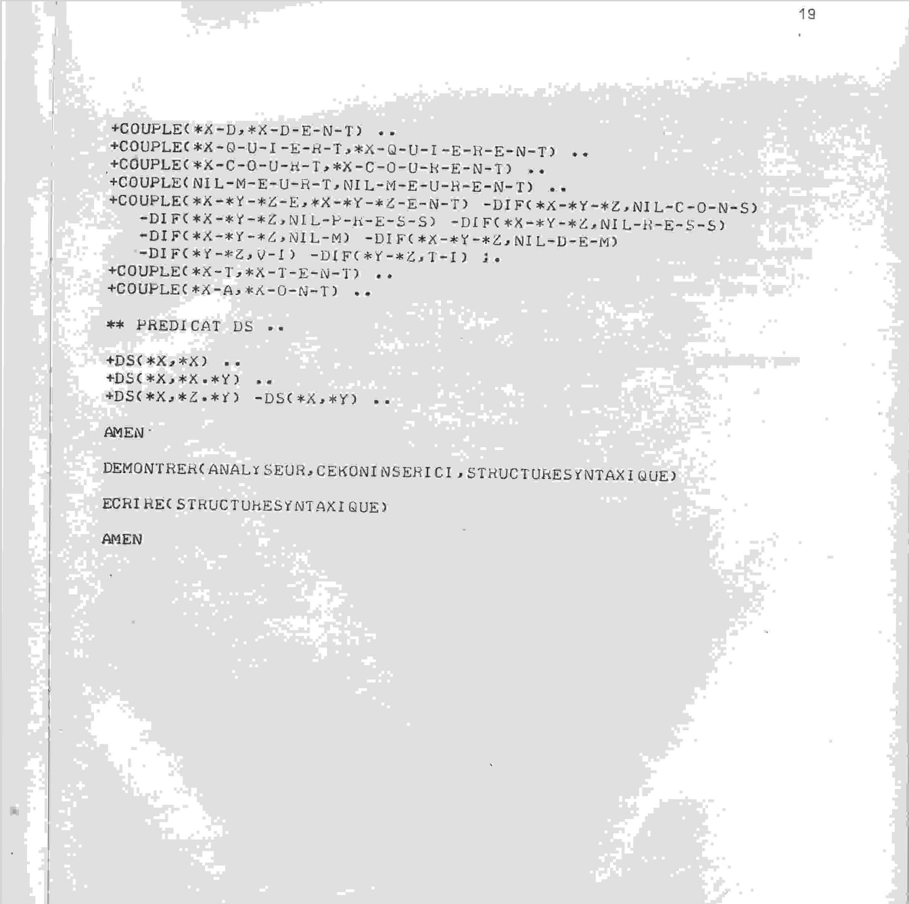

# Prolog and Logic Programming for Elixir Developers
## Paris Elixir User Group Presentation

- **Speaker:** Ori Pekelman
- **Date:** 11/09/2025
- **GitHub:** https://github.com/OriPekelman/swiex

---
Let's start with the shortest valid Prolog program, if we were in 1972.

```prolog
AMEN
```

Anyone designing a new programming language **MUST** from henceforward by my royal decree use AMEN as the program terminator. Other than * and () it was the only actual reserved tokens.

And this talk could happily ended with this discovery - but you came and everything.

---

>The standard way of describing Prolog in itself is to use a simple
meta-interpreter:

```prolog
  solve((A,B)) :- solve(A), solve(B).
  solve(A) :- builtin(A), call(A).
  solve(A,B) :- rule(A, B), solve(B).
```

> The problem with this meta-interpreter is that the set of remaining goals that is not yet solved is not available for program manipulation.
> **Joe Amstrong**

--- 
This is a great moment to tell you the earliest Erlang was written in Prolog. Joe actually considered using it. But Prolog didn't have concurrency. And it wasn't built for deterministic operation. Which you'd want if you run the phone network on it.

So don't be surprised to find some very familiar concepts in Prolog.

---

Also, don't you worry much of this will be explained. 

* Prolog is a logic programming language. 
* It demonstrates stuff. 

---

> "Erlang is essentially Prolog with processes... We took Prolog, removed backtracking, added processes, and spent 25 years figuring out the consequences."
> **Joe Amstrong**


--- 

Actually, Joe removed a bit more from Prolog. 

We will talk later about unification and why backtracking is required for it. But let's also say that Prolog is a fully homoiconic language. Which means it is good at reading itself. Code is data. 

--- 

> The programming language, Prolog, was born of a project aimed not at producing a programming language but at processing natural languages; in this case, French. 
> **Alain Colmerauer and Philippe Roussel**

--- 
# Ah Oui !
---

During the fall of 1972, the first Prolog system was implemented by Philippe (Roussel) in Niklaus Wirt’s language Algol-W; 

The title of their report was actually "**UN SYSTEME DE COMMUNICATION HOMME-MACHINE EN FRANCAIS**"


--- 

And it could do this:
```
TOUT PSYCHIATRE EST UNE PERSONNE.
CHAQUE PERSONNE QU’IL ANALYSE, EST MALADE.
JACQUES EST UN PSYCHIATRE A *MARSEILLE.
EST-CE QUE *JACQUES EST UNE PERSONNE?
OU EST *JACQUES?
EST-CE QUE *JACQUES EST MALADE?
OUI. A MARSEILLE. JE NE SAIS PAS.
```
--- 

> In fact, the system knew only about pronouns, articles and prepositions (the vocabulary was encoded by 164 clauses), it recognized proper nouns from the mandatory asterisk which had to precede them as well as the verbs and common nouns on the basis of the 104 clauses for French morphology
> **Alain Colmerauer**

--- 

> It is difficult to use a computer to analyze a sentence. The main problem is combinatorial in nature [...] To describe this multitude of groupings in an economical way, I use an oriented graph in which each arrow is labeled by a parenthesized expression representing a tree. A Q-system is nothing more than a set of rules allowing such a graph to be transformed into another graph. This information may correspond to an analysis, to a sentence synthesis or to a formal manipulation of this type.
> **Alain Colmerauer**

--- 
# An early Prolog program (from the paper).
```prolog
LIRE
REGLES
  +DESC(*X,*Y) -ENFANT(*X,*Y);;
  +DESC(*X,*Z) -ENFANT(*X,*Y) -DESC(*Y,*Z);;
  +FRERESOEUR(*X,*Y)
    -ENFANT(*Z,*X) -ENFANT(*Z,*y) -DIF(*X,*Y);;
  AMEN
```
---
```prolog
LIRE
  FAITS
  +ENFANT(PAUL,MARIE);;
  +ENFANT(PAUL,PIERRE);;
  +ENFANT(PAUL,JEAN);;
  +ENFANT(PIERRE,ALAIN);;
  +ENFANT(PIERRE,PHILIPPE);;
  +ENFANT(ALAIN,SOPHIE);;
  AMEN
```
---
```prolog
LIRE
  QUESTION
  -FRERESOEUR(MARIE,*X)
  -DESC(*X,*Y) / +PETITNEVEUX(*Y) -MASC(*Y)..
  AMEN

CONCATENER(LIENSDEPARENTE,REGLES,FAITS)
DEMONTRER(LIENSDEPARENTE,QUESTION,REPONSE)
ECRIRE(REPONSE)
AMEN
```
And the answer is:
```
+PETITNEVEUX(ALAIN) -MASC(ALAIN);.
+PETITNEVEUX(SOPHIE) -MASC(SOPHIE);.
+PETITNEVEUX(PHILIPPE) -MASC(PHILIPPE);.
```
---
# Prolog was built to read language - Erlang to run Telcos - Elixir to run the Web.


So as I said, Joe Armstrong removed backtracking which we will get into. But also **Homoiconicity**.

---
### Homoiconicity

You know, the LISP thing: the program's abstract syntax tree (AST) is directly manipulable as a native data structure. Code is data is code is data.

This enables:
- Code that writes code
- Powerful macros
- Runtime code manipulation
- Reflection and metaprogramming

--- 
## Prolog programs can inspect and modify themselves:
```prolog
% Add a new clause at runtime
:- dynamic factorial/2.
?- assertz((factorial(N, F) :- N < 0, F = error)).

% Query the program about itself
program_has_predicate(Name/Arity) :-
    current_predicate(Name/Arity).

% Generate new predicates from data
create_rule(Name, Args, Body) :-
    Head =.. [Name | Args],  % Build term from list
    assertz((Head :- Body)).
```
--- 

## Erlang's homoiconicity is **limited**:
- Pattern matching works on data, not code
- Code manipulation requires parse transforms
- The AST format is verbose and not idiomatic

--- 

```erlang
% Parse transforms allow compile-time metaprogramming
-compile({parse_transform, my_transform}).

% But runtime code generation is awkward
make_function(Name, Body) ->
    % Must construct AST manually
    FormData = {function, 0, Name, 1,
                [{clause, 0, [], [], Body}]},
    {ok, Name, Bin} = compile:forms([FormData]),
    code:load_binary(Name, "dynamic", Bin).
```

--- 
## Elixir's macros actually make it **practically homoiconic**:

```elixir
defmacro create_functions(names) do
  for name <- names do
    quote do
      def unquote(name)(), do: unquote("Hello from #{name}")
    end
  end
end

create_functions([:foo, :bar, :baz])
foo() # => "Hello from foo"
```
--- 

| Aspect | Prolog | Erlang | Elixir |
|--------|---------|---------|---------|
| **Syntax matches data** | ✓ Terms everywhere | ✗ AST ≠ normal data | ✗ AST ≠ normal code |
| **Runtime code generation** | ✓ Natural | ~ Possible but awkward | ~ Via Code.eval |
| **Compile-time metaprogramming** | ✓ Via term expansion | ✓ Parse transforms | ✓ Powerful macros |
| **Code inspection** | ✓ clause/2, functor/3 | ~ Via debug_info | ✓ Via quote/unquote |
| **Pattern match on code** | ✓ Directly | ✗ Only on AST | ✓ On quoted AST |

--- 
### Homoiconicity

This evolution from Prolog → Erlang → Elixir shows a trade-off: losing syntactic homoiconicity for better performance and clearer code, but regaining metaprogramming power through the macro system.

Why care about this? What does it have to do with logic programming?  Just shows the impact of the language-use-case on the language-design.

---

# Back to Prolog proper and its basic concepts

* **Facts** are basic assertions about the world `parent(tom, bob).` that form the knowledge base. 
* **Rules** define relationships and logical implications using facts and other rules `grandparent(X, Z) :- parent(X, Y), parent(Y, Z).`, essentially saying "this is true if these conditions are met." 
* **Goals** (or queries) are questions you ask Prolog `?- grandparent(tom, Who).`  that it attempts to prove using the facts and rules. 

--- 
# Prolog wants things to be true.

```
lumière(on) :- interrupteur(on).        
            <-                           
```
The light is on **IF** the switch is on. Logical. We might better say the "switch on" implies the "light on".
```
père(X,Y) :- parent(X,Y), mâle(X).      
          <-           AND               
```
X is the father of Y **IF** X is a parent of Y **AND** X is male.
```
parent(X, Y) :- père(X, Y) ; mère(X, Y).
             <-           OR             
```
X is a parent of Y **IF** it is the father **OR** the mother of Y.

---

# Unification: Prolog's Core Operation

Unification is bidirectional pattern matching with variable binding. It's not assignment, it's not equality testing—it's both and more.

Unification attempts to make two terms identical by finding values for variables that appear in them.

Together **facts, rules and goals** transform Prolog into a theorem prover: 
* you declare what is true (facts), 
* how to derive new truths (rules), 
* ask questions (goals),  
* and Prolog uses unification and backtracking to search for all possible answers.

--- 
## Unification Failure Triggers Backtracking

```
% Multiple clauses to try
color(apple, red).
color(apple, green).
color(banana, yellow).

% Query with unification
?- color(apple, X), X = red.
% Step 1: Try first clause, X unifies with red ✓
% Success: X = red

?- color(apple, X), X = yellow.
% Step 1: Try first clause, X unifies with red
% Step 2: Try X = yellow... FAIL! (red ≠ yellow)
% Step 3: BACKTRACK, unbind X
% Step 4: Try second clause, X unifies with green  
% Step 5: Try X = yellow... FAIL! (green ≠ yellow)
% Step 6: BACKTRACK, no more clauses
% Result: false
```

--- 

# Unification + Backtracking = Search

```prolog
% Sorting without explicit algorithm!
sorted([]).
sorted([_]).
sorted([X,Y|T]) :- X =< Y, sorted([Y|T]).

permutation([], []).
permutation(L, [H|T]) :- 
    select(H, L, Rest),   % Backtracking through choices
    permutation(Rest, T).

% Naive sort: generate permutations until one is sorted
naive_sort(List, Sorted) :-
    permutation(List, Sorted),  % Generate via backtracking
    sorted(Sorted).             % Test via unification
```

```
naive_sort([3,1,2], Sorted).
```

--- 
## How did I get into this mess?

**Blame Edmund**
* So the thing was we were working on a project.
* And I was like: hey this sounds distributed I'll do Elixir.
* And Edmund was like: I am too bored and have too little patience so I'll express it in Prolog.
--- 
## How did I get into this mess?

* Afterwards, I have been writing a uchronic science-fiction novel, with quite a complex backstory. And a couple-hundred-pages-in I really wanted to be able to do some sanity checks on the coherence of my world. So WTF. Why not?
* The other thing is that I actually like the pattern of using Elixir as the umbrella for running stuff I wouldn't otherwise trust in production.
---


## **The Programming Paradigm Spectrum**

```
Imperative Programming    Functional Programming    Logic Programming
      "HOW?"                   "WHAT?"               "WHAT THE FUCK?"
        |                        |                        |
        |                        |                        |
 Do this, then that,   Transform this reality       What is reality?
 hopefully reality     representation to that       Does anything make
 conforms              reality representation       Sense?
        |                        |                        |
        |                        |                        |
    C, Java, Python         Elixir, Haskell, F#        Prolog, Datalog
```

**Logic programming sits at the extreme "what" end of declarative programming and it can also answer "Why"s? ... sometimes ...**

---

### **From Functions to Relations**

**Elixir (Functional):**
```elixir
def find_grandparents(person, family_tree) do
  family_tree
  |> get_parents(person)
  |> Enum.flat_map(&get_parents(&1, family_tree))
end
```

**Prolog (Logic):**
```prolog
grandparent(X, Z) :- parent(X, Y), parent(Y, Z).
```

**Same code works in ALL directions**

---

## **Bidirectional Programming**
### **One Rule, Multiple Uses**

```prolog
% Define the relationship
grandparent(X, Z) :- parent(X, Y), parent(Y, Z).

% Find all grandparents of John
?- grandparent(X, john).
X = mary ; X = bob ; X = alice.

% Find all grandchildren of Mary
?- grandparent(mary, X).
X = john ; X = sarah ; X = tom.

% Check if Alice is John's grandparent
?- grandparent(alice, john).
true.
```

**The same 1-line rule answers 3 different types of questions.**

---
# Facts, Rules, Unification, Backtracking.

### **1. Facts and Rules (Not Functions)**
```prolog
% Facts - unconditional truths
parent(john, mary).
parent(mary, bob).

% Rules - conditional relationships
grandparent(X, Z) :- parent(X, Y), parent(Y, Z).
```
---
### **2. Unification (Bidirectional Pattern Matching)**
```prolog
% Works both ways!
append([1,2], [3,4], X).     % X = [1,2,3,4]
append(X, Y, [1,2,3,4]).     % X = [], Y = [1,2,3,4] ; X = [1], Y = [2,3,4] ; ...
```
---
### **3. Automatic Backtracking**
```prolog
% Finds ALL solutions automatically
?- member(X, [1,2,3]).
X = 1 ; X = 2 ; X = 3 ; false.
```
---

## **Mental Model Shifts for Elixir Developers**

| **Elixir Thinking** | **Prolog Thinking** |
|---------------------|---------------------|
| "How do I compute X from Y?" | "What relationships exist between X and Y?" |
| Functions return one result | Queries explore all possible solutions |
| Explicit recursion management | Automatic backtracking handles search |
| Pattern matching binds left to right | Unification works bidirectionally |
| Error handling | Failure triggers backtracking |

---

### **Prolog usefulness**

1. **Constraint Satisfaction Problems** - N-Queens, Sudoku, Graph Coloring
2. **Expert Systems & Rule Engines** - Medical diagnosis, business rules
3. **Natural Language Processing** - Parsing, semantic analysis
4. **Causal Reasoning** - Why?
5. **Graph Traversal** - Finding paths, cycles, relationships

---

# Demo time

* https://main-bvxea6i-xdi2igb4vnxny.ch-1.platformsh.site/
* https://llm-jb5zcba-xdi2igb4vnxny.ch-1.platformsh.site/

--- 

## **Swiex** - An already irrelevant name.

Why did I not use ex_prolog or erlog? 

1. Because I was too lazy/stupid to imagine someone else would have already done this.
2. Learning by doing is nice.
3. I did implement some bells and whistles that would have been difficult with the existing seemingly not really maintained basis... 

--- 

- **Seamless Integration:** Use Prolog from Elixir code
- **Variable Sharing:** Pass data between languages
- **Hot Code Loading:** Update Prolog rules without restarting
- **Session management:** Have multiple long running processes each with its own facts context
- **Multiple Runtimes:** Swipl, Scryer, Erlog

**Elixir handles system coordination, Prolog handles reasoning**

---
```elixir
defmodule CausalReasoning do
  def find_causal_paths(start, end) do
    with {:ok, session} <- Swiex.MQI.start_session() do
      # Load knowledge base
      load_causenet_data(session)
      
      # Execute Prolog query
      case Swiex.MQI.query(session, "causal_path('#{start}', '#{end}', Path)") do
        {:ok, results} -> 
          paths = Enum.map(results, &(&1["Path"]))
          Swiex.MQI.stop_session(session)
          {:ok, paths}
        {:error, reason} -> 
          Swiex.MQI.stop_session(session)
          {:error, reason}
      end
    end
  end
end
```
---

### **"But I have questions..."**

**Q: "Is Prolog still relevant?"**
A: Probably not.

**Q: "Is it secure?"**
A: Nopes.

**Q: "Does it have anything to do with LLMs"**
A: Probably.

**Q: "Can you use swiex to summon ancient evil spirits"**
A: It does.

---

## 🎯 **Resources **

- **Swiex Documentation:** https://github.com/OriPekelman/swiex
- **SWI-Prolog MQI:** https://www.swi-prolog.org/pldoc/man?section=mqi
- **Scryer Prolog:** https://www.scryer.pl/
- **Erlog by Robert Virding:** https://github.com/rvirding/erlog/
- **History of Prolog:** http://alain.colmerauer.free.fr/alcol/ArchivesPublications/PrologHistory/19november92.pdf and in French: http://alain.colmerauer.free.fr/alcol/ArchivesPublications/PrologHistoire/24juillet92plus/24juillet92plusvar.pdf
- **The Fascinating Original Paper:** http://alain.colmerauer.free.fr/alcol/ArchivesPublications/HommeMachineFr/HoMa.pdf 
- **About the implementations:** an Incredible introduction to the Warren Abstract Machine. - https://webperso.info.ucl.ac.be/~pvr/PRL-TR-36.pdf  and how all of this is implemented.
- **Example Projects:** Check the Swiex examples directory

---

## 🎯 * Thank You!**


